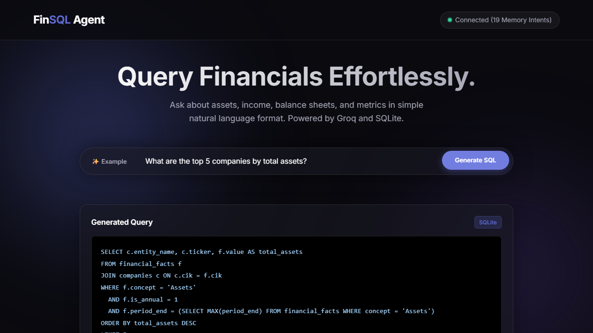
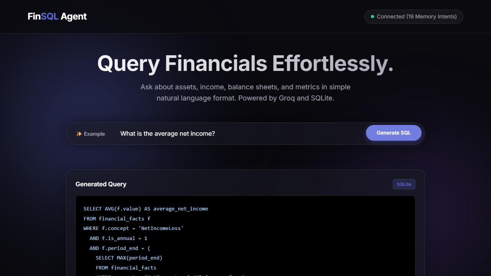
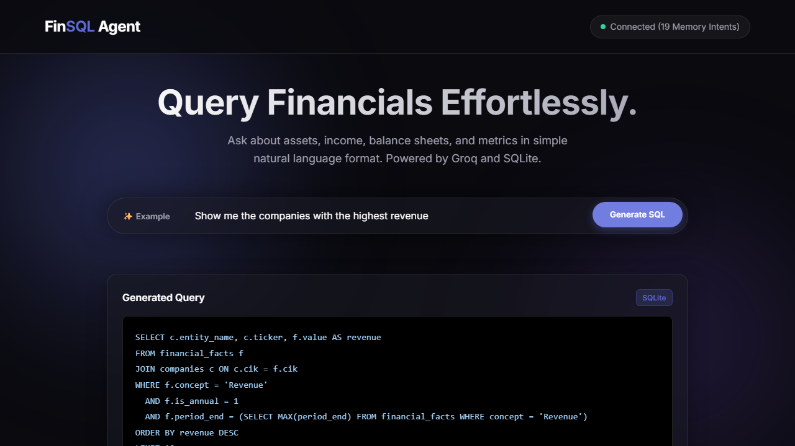

# Financial NL2SQL Agent
An enterprise-grade Natural Language to SQL pipeline designed to query financial metrics stored in an SQLite database effortlessly.

This project uses a layered architecture to securely convert conversational questions into optimal, strictly validated SQL queries, executing them against a local domain database, and serving the results through an elegant API and web UI.

---

## Key Features & Implementations

1. **Accuracy-First LLM Layer (`app/llm.py`, `app/schema.py`)**
    - **Advanced Prompt Engineering**: Includes 8+ strict accuracy rules covering deduplication, annual data quality (10-K preference), and balance sheet snapshot safety.
    - **Fiscal Calendar Awareness**: Native handling of non-calendar fiscal years for companies like AAPL (Sep), MSFT (Jun), and NVDA/CRM/SNOW/CRWD (Jan).
    - **Concept Aliasing**: Automatically handles historical XBRL concept name changes (e.g., shifts in Revenue concept names over decades).

2. **Multi-Backend Agent Memory (`app/memory.py`, `app/seed_memory.py`)**
    - **Pinecone & ChromaDB Support**: Choose between high-performance cloud vector search (Pinecone) or local persistence (ChromaDB).
    - **Validated Seeding**: The `seed_memory.py` utility live-validates every training example against the actual database before injection, ensuring no "empty-result" patterns are learned.

3. **Strict Security & Validation (`app/security.py`)**
    - **Read-Only Enforcement**: Rigid RegEx guards against `DROP`, `DELETE`, `ALTER`, etc.
    - **Schema Cross-Referencing**: Validates all generated column and table references against live database metadata.

4. **FastAPI Web Delivery (`app/api.py`, `app/models.py`)**
    - Integrated with a modern Glassmorphic UI served from `static/`.
    - Health monitoring endpoints including agent memory counts.

---

## Configuration

The application is fully configurable via the `.env` file. 

| Variable | Description | Default |
|----------|-------------|---------|
| `MEMORY_TYPE` | Choose `demo`, `chroma`, or `pinecone` | `demo` |
| `GROQ_API_KEY` | Your API key for LLM generation | (Required) |
| `PINECONE_API_KEY` | Required if `MEMORY_TYPE=pinecone` | - |
| `PINECONE_INDEX_NAME` | The name of your Pinecone index | `nl2sql-memory` |
| `CHROMA_PATH` | Path for local ChromaDB storage | `./chroma_db` |

---

## Setup & Running

1. **Install Dependencies**:
   ```bash
   pip install -r requirements.txt
   # For Pinecone support:
   pip install pinecone vanna[pinecone]
   ```

2. **Seed Memory**:
   Before running for the first time, seed your agent's memory:
   ```bash
   python -m app.seed_memory
   ```

3. **Launch Server**:
   ```bash
   uvicorn main:app --reload
   ```

4. **Access UI**: Visit `http://127.0.0.1:8000` in your browser.

---

## Example Queries

Below are screenshots of complex NL2SQL queries executed against the database:





---

## File Structure
- `app/api.py`: FastAPI Routes and lifecycle management.
- `app/llm.py`: Expert SQL generation with domain accuracy rules.
- `app/memory.py`: abstraction for different vector database backends.
- `app/seed_memory.py`: Live-validated training data for the agent.
- `static/`: Beautiful Dark-Mode Glassmorphism Web Interface.
- `main.py`: The Uvicorn entry point.
